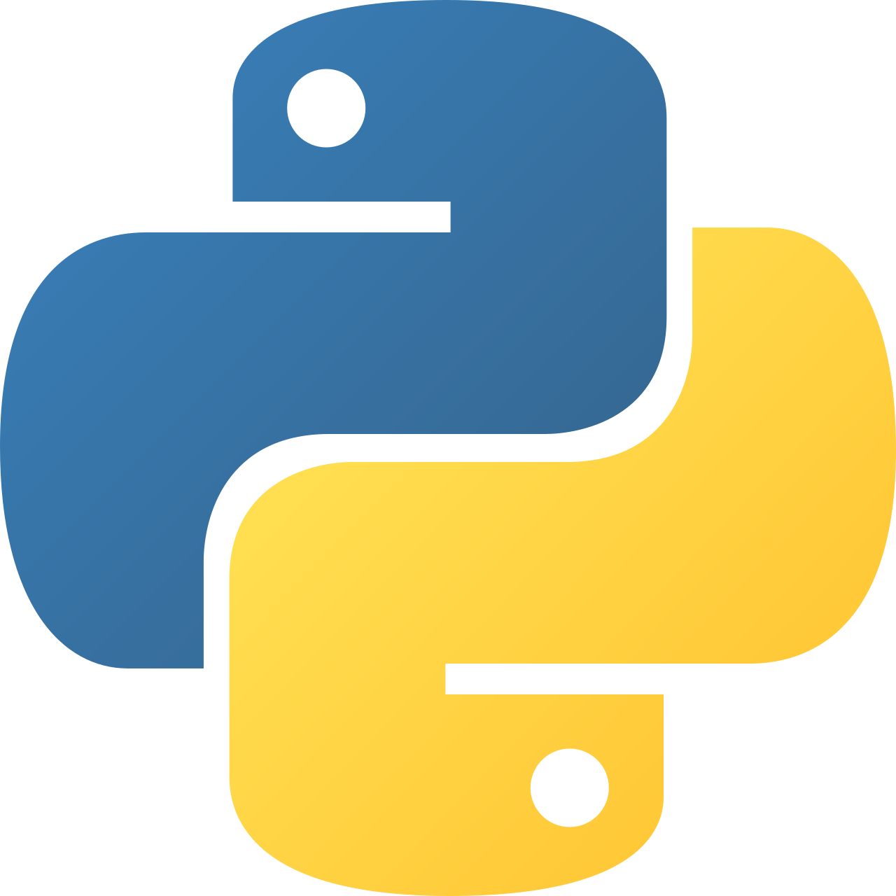
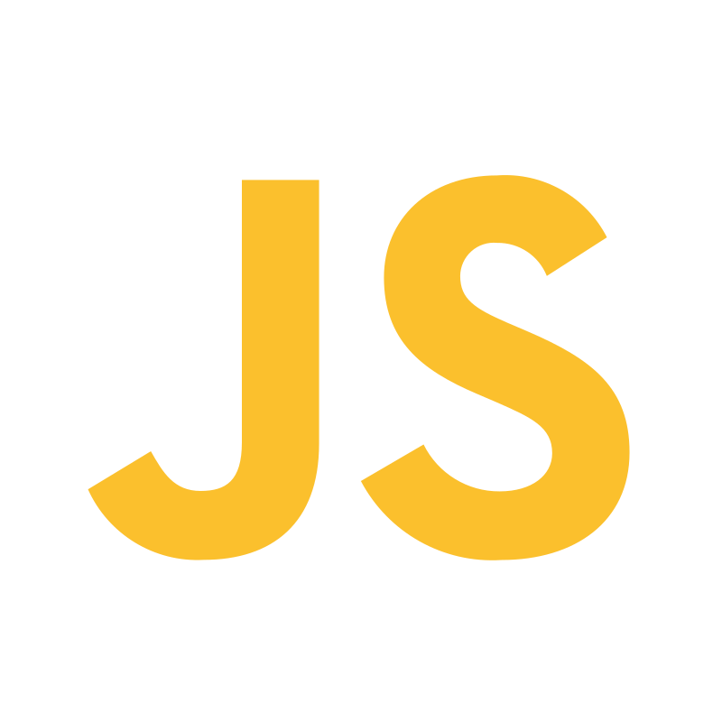
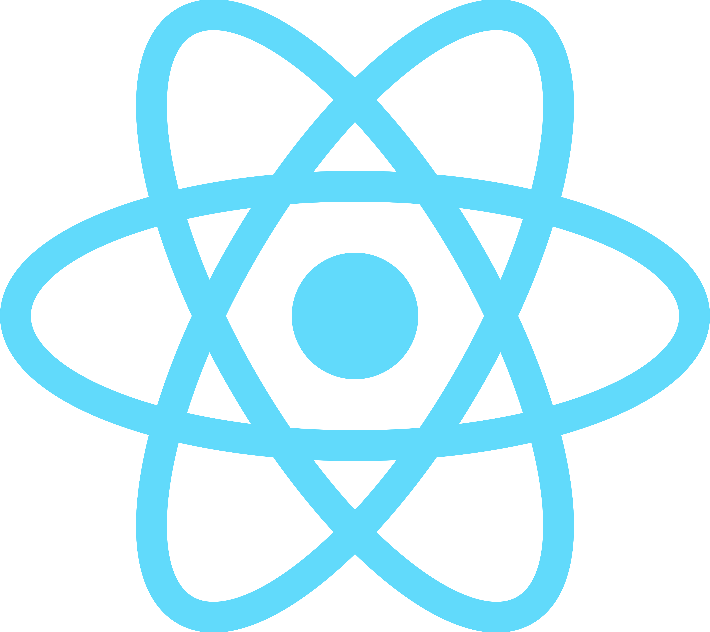
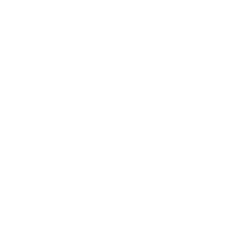
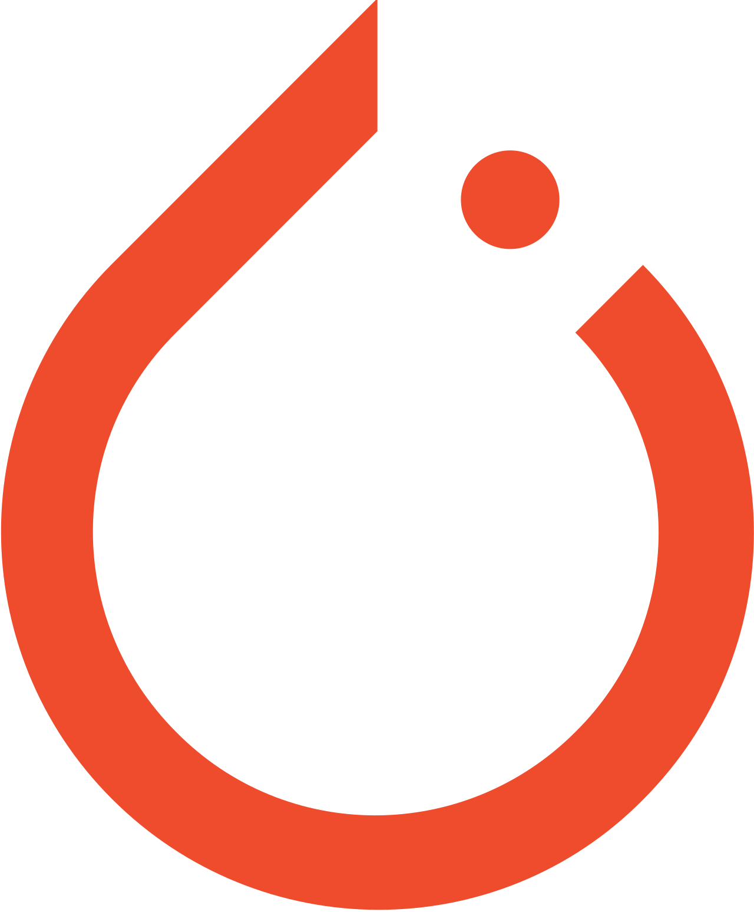
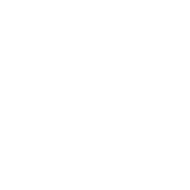

# Abraham Bhatti

 

I build **production-grade AI systems** — multi-agent orchestrators, RAG pipelines, multimodal inference engines, and full-stack apps that ship.  
Currently interning in AI research @ SCU and exploring the frontier of agentic AI.

---

## Favorites

<table>
<tr>
<td width="50%" valign="top">

### Power2thePeople
**NVIDIA Spark Hackathon 2026 — Winner**

Real-time civil rights assistant running on **NVIDIA DGX Spark** with Nemotron-70B. Deployed via **Meta smart glasses** — live multimodal scene understanding, ASR, and legal RAG pipeline with < 500ms response latency. Detects police misconduct patterns, generates legal reports, and delivers real-time audio guidance on your rights.

`Python` `DGX Spark` `Nemotron-70B` `VLM` `RAG` `Meta SDK` `Edge Computing`

</td>
<td width="50%" valign="top">

### Play-gent
**PyTorch OpenEnv Hackathon — 4th Place**

Curriculum-trained RL negotiation agent. Extracted human decision-making from **200k+ Diplomacy game states** and **50k poker hands**. Deployed a 1.1B policy model against adversarial 8B LLaMA counterparts with real-time bluff detection, achieving **1.88x capital return**.

`Python` `TinyLlama` `GRPO` `TRL` `DistilBERT` `Curriculum RL` `W&B`

</td>
</tr>
<tr>
<td width="50%" valign="top">

### Sentinel SDK
**Continual Learning Hackathon — 2nd Place** *(65+ teams)*

Secure autonomous agent runtime and SDK. Monitors, validates, and sandboxes all CLI tool calls in real time using an async agent loop, dynamic policy enforcement, and LLM-powered threat detection. Integrates with OpenCode + Composio for GitHub threat reporting.

`Python` `TypeScript` `SDK Design` `Sandboxing` `LLMs` `Akash` `Composio`

</td>
<td width="50%" valign="top">

### ToolForge
**Llama Lounge x Snowflake x Cerebral Valley Hackathon — 2nd Place**

Autonomous **Planner–Builder–Validator** pipeline that designs, implements, and verifies tools end-to-end. Wired to **150+ third-party integrations** for real-world actions, with **Snowflake** backing persistent storage so validated skills compound across sessions instead of starting cold each run.

`Python` `Multi-Agent` `Snowflake` `LLMs` `Tool Use` `Orchestration`

</td>
</tr>
</table>

---

## Skills

**Core Stack**

      

**AI / ML**

  

**Infra & DevOps**

    

---

## GitHub Stats

  

---

